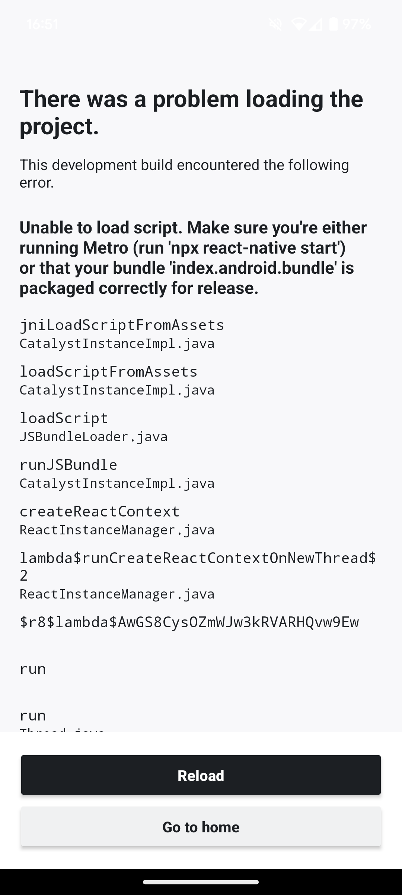

# Expo SDK 50 Android Development Build Error

This is a minimal reproducible example of an error you get when trying to build an Android app with Expo SDK 50 and a
certain combination of dependencies.

Note that this problem does not occur with the Android Emulator, or with iOS Simulator or physical iOS devices.

## Steps to reproduce

You need a physical Android device. In my test I used a Google Pixel 6 running Android 14.

- Check out the repository
- Run `yarn install`
- Run `yarn build:development:android` to create the development client and copy the APK to your device
- Run `yarn start` to start the development server
- Open the Expo Go app on your device and scan the QR code in the terminal
- Wait for the app to load, you will see the following error screen:

